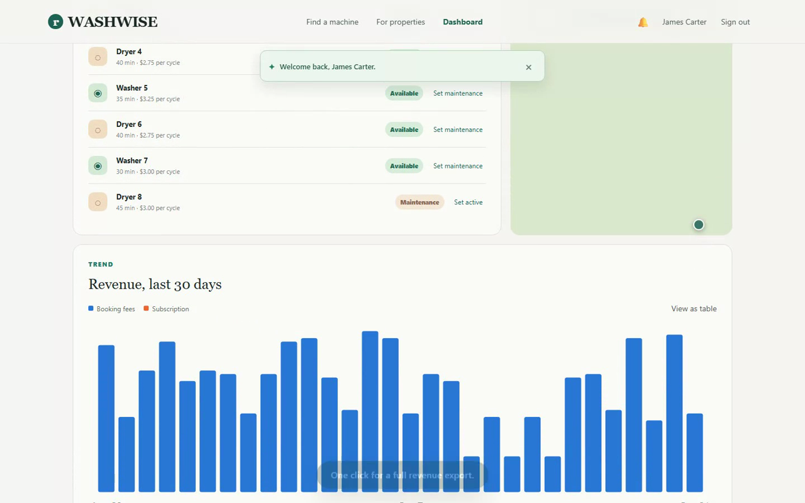

# WashWise

[](https://github.com/Sufyaan2655/WashWise/actions/workflows/backend-tests.yml)

A full-stack laundry reservation platform for apartment buildings. Tenants see
live washer/dryer availability, reserve a machine, and pay in one flow.
Property managers get a live operations dashboard with machine status,
revenue, and subscription tracking.

**Stack:** SvelteKit 5 · Flask (raw SQL, no ORM) · MySQL (stored procedures,
triggers, views) · JWT auth

## Demo

[](docs/washwise-demo.mp4)

*(Click the screenshot to play the video.)* A captioned ~1:45 walkthrough
recorded against the running app: a resident reserving a machine and getting
an instant notification, then a property manager's live revenue dashboard.

## Features

**Resident**
- Live washer/dryer availability, scoped to the resident's building
- Reserve a machine and pay in one flow, with booking-overlap prevention
  enforced by a database trigger
- Booking history and cancellation
- Join a waitlist for a busy machine; automatically notified when it frees up
- In-app notifications, with optional email and SMS delivery

**Property manager**
- Machine inventory with one-click maintenance toggling
- Live booking-fee and subscription revenue, plus a 30-day revenue trend chart
- Building subscription plan and billing history
- One-click revenue export to Excel

**Platform**
- JWT authentication with role- (tenant vs. manager) and ownership-based
  access control enforced server-side on every protected route, not just
  hidden in the UI
- CI: the full backend test suite runs on every push via GitHub Actions

## Revenue Model

WashWise uses two revenue streams:

1. A transaction fee from every laundry booking
2. A recurring SaaS subscription paid by each apartment building

Example for a $3.00 laundry cycle:

- Building share: $2.55
- Platform fee: $0.45
- Transaction fee rate: 15%

The split is stored per-payment in `booking_payments`. Building subscriptions
are tracked with `subscription_plans`, `building_subscriptions`, and
`subscription_payments`.

## Database

10 tables, normalized to at least Second Normal Form:

`buildings` · `users` · `machines` · `bookings` · `booking_payments` ·
`subscription_plans` · `building_subscriptions` · `subscription_payments` ·
`notifications` · `waitlist`

- All queries are parameterized (no string-built SQL)
- Foreign keys enforce referential integrity throughout
- `sp_book_machine` and `sp_revenue_report` stored procedures
- `BEFORE INSERT`/`BEFORE UPDATE` triggers on `bookings` validate every
  reservation (same building, machine operational, no overlap) at the
  database layer — independent of whatever the API does
- Indexes and views (`v_revenue_by_building`, `v_booking_details`,
  `v_active_subscriptions`) back the reporting endpoints

## API

```text
POST   /login
GET    /me
GET    /machines
POST   /bookings
GET    /users/<user_id>/bookings
DELETE /bookings/<booking_id>
POST   /machines/<machine_id>/waitlist
GET    /users/<user_id>/waitlist
GET    /users/<user_id>/notifications
GET    /subscriptions
GET    /reports/revenue
GET    /reports/revenue/timeseries
```

Every route above except `/login`, signup (`POST /users`), and the public
`GET /machines` / `GET /plans` requires an `Authorization: Bearer <token>`
header from `/login`. Role and ownership checks are covered in
[`backend/test_auth.py`](backend/test_auth.py).

## Getting Started

Requires MySQL, Python 3, Node.js, and npm.

```bash
git clone https://github.com/Sufyaan2655/WashWise.git
cd WashWise
```

### 1. Database

Open MySQL Workbench (or any MySQL client) and create a database named
`washwise`, then run these files against it, in order:

```text
backend/schema.sql
backend/procedures.sql
backend/indexes_views.sql
```

All three are required — the test suite depends on the procedures, triggers,
indexes, and views they create.

### 2. Backend

```bash
cd backend
python3 -m venv venv
source venv/bin/activate      # Windows: venv\Scripts\activate
pip install -r requirements.txt
cp .env.example .env
```

Edit `backend/.env` with your MySQL credentials:

```text
DB_HOST=127.0.0.1
DB_PORT=3306
DB_USER=root
DB_PASSWORD=your_mysql_password
DB_NAME=washwise
SECRET_KEY=change_this_to_a_random_secret
ALLOWED_ORIGINS=*
```

`SECRET_KEY` signs login tokens — any random string works locally.
`ALLOWED_ORIGINS` controls CORS; `*` is fine for local dev.

Email and SMS notifications are optional. Leaving `SMTP_*` and `TWILIO_*`
blank is fine — the app still records every notification in-app and just
logs that it skipped sending. To turn them on:

- **Email**: create a Google app password at
  [myaccount.google.com/apppasswords](https://myaccount.google.com/apppasswords)
  and set `SMTP_HOST=smtp.gmail.com`, `SMTP_PORT=587`, `SMTP_USER`, `SMTP_PASSWORD`.
- **SMS**: create a free trial account at
  [twilio.com/try-twilio](https://www.twilio.com/try-twilio) and set
  `TWILIO_ACCOUNT_SID`, `TWILIO_AUTH_TOKEN`, `TWILIO_FROM_NUMBER`.

`.env` is gitignored — never commit it.

Seed demo data and run the tests:

```bash
python3 seed.py
pytest test_api.py test_db.py test_auth.py -v
```

A successful run reports `39 passed`. Then start the API:

```bash
python3 app.py
```

Runs at `http://127.0.0.1:5001`. Keep this terminal open.

### 3. Frontend

In a new terminal:

```bash
cd frontend
npm install
npm run dev
```

Open the address Vite prints, typically `http://localhost:5173`.

### Demo accounts

| Role    | Email                  | Password      |
|---------|-------------------------|---------------|
| Manager | `jcarter@example.com`   | `password123` |
| Tenant  | `wchen@example.com`     | `password123` |

### Deploying

The frontend deploys to Vercel as-is (`@sveltejs/adapter-auto` detects Vercel
at build time). Set `VITE_API_URL` in the Vercel project's environment
variables to the deployed backend's URL, and set `ALLOWED_ORIGINS` on the
backend to the deployed frontend's URL so CORS allows it.

## Project Structure

```text
WashWise/
├── .github/workflows/
│   └── backend-tests.yml
├── backend/
│   ├── app.py              # Flask routes
│   ├── auth.py              # JWT + role/ownership checks
│   ├── notify.py             # in-app + email/SMS notifications
│   ├── db.py                # MySQL connection helper
│   ├── schema.sql / procedures.sql / indexes_views.sql
│   ├── seed.py               # demo + generated history data
│   └── test_api.py / test_db.py / test_auth.py
├── database/                # secondary schema copy (column-compatible with backend/)
├── docs/                    # diagrams, demo video
├── frontend/
│   ├── src/
│   │   ├── app.css
│   │   ├── lib/
│   │   │   ├── api.js, config.js
│   │   │   ├── stores/       # auth, machines, bookings, waitlist, notifications
│   │   │   └── components/   # Header, AuthModal, MachineCard, RevenueChart, ...
│   │   └── routes/           # /, /machines, /bookings, /pricing, /dashboard
│   └── package.json
└── compose.yaml              # MySQL via Docker, for local dev
```
